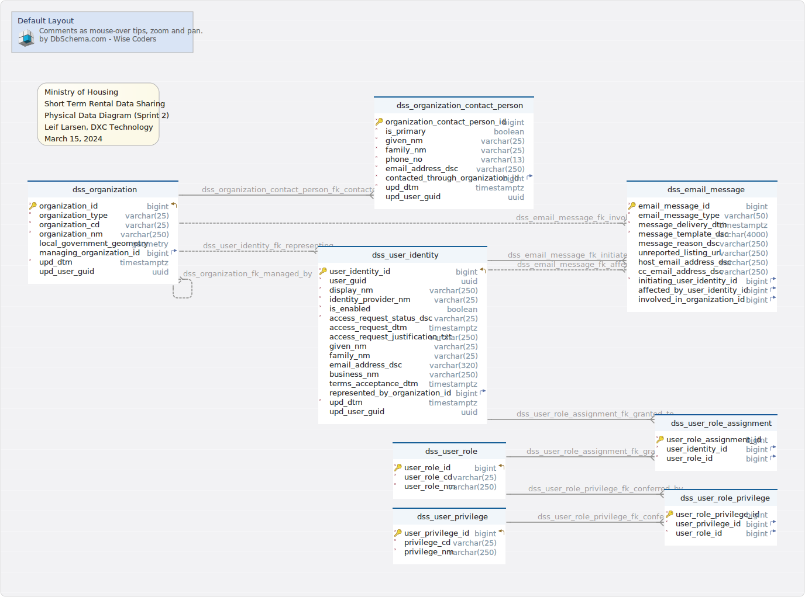

#Default Layout
Generated using [DbSchema](https://dbschema.com)

### Default Layout

### Table dss.dss_email_message 
A message that is sent to one or more recipients via email

|Idx |Name |Data Type |Description |
|---|---|---|---|
| * &#128273;  | email\_message\_id| bigint GENERATED ALWAYS AS IDENTITY  | Unique generated key |
| * | email\_message\_type| varchar(50)  | Business term for the type or purpose of the message (e.g. Notice of Takedown, Takedown Request, Delisting Warning, Delisting Request, Access Granted Notification, Access Denied Notification) |
| * | message\_delivery\_dtm| timestamptz  | A timestamp indicating when the message delivery was initiated |
| * | message\_template\_dsc| varchar(4000)  | The full text or template for the message that is sent |
|  | message\_reason\_dsc| varchar(250)  | A description of the justification for initiating the message |
|  | unreported\_listing\_url| varchar(250)  | User-provided URL for a short-term rental platform listing that is the subject of the message |
|  | host\_email\_address\_dsc| varchar(250)  | E-mail address of a short term rental host (directly entered by the user as a message recipient) |
|  | cc\_email\_address\_dsc| varchar(250)  | E-mail address of a secondary message recipient (directly entered by the user) |
| * &#11016; | initiating\_user\_identity\_id| bigint  | Foreign key |
| &#11016; | affected\_by\_user\_identity\_id| bigint  | Foreign key |
| &#11016; | involved\_in\_organization\_id| bigint  | Foreign key |

##### Indexes 
|Type |Name |On |
|---|---|---|
| &#128273;  | dss\_email\_message\_pk | ON email\_message\_id|

##### Foreign Keys
|Type |Name |On |
|---|---|---|
|  | dss_email_message_fk_initiated_by | ( initiating\_user\_identity\_id ) ref [dss.dss\_user\_identity](#dss\_user\_identity) (user\_identity\_id) |
|  | dss_email_message_fk_affecting | ( affected\_by\_user\_identity\_id ) ref [dss.dss\_user\_identity](#dss\_user\_identity) (user\_identity\_id) |
|  | dss_email_message_fk_involving | ( involved\_in\_organization\_id ) ref [dss.dss\_organization](#dss\_organization) (organization\_id) |

##### Constraints
|Name |Definition |
|---|---|
| dss_email_message_ck | email\_message\_type in ('Notice of Takedown','Takedown Request','Delisting Warning','Delisting Request','Access Granted Notification','Access Denied Notification') |

### Table dss.dss_organization 
A private company or governing body that plays a role in short term rental reporting or enforcement

|Idx |Name |Data Type |Description |
|---|---|---|---|
| * &#128273;  &#11019; | organization\_id| bigint GENERATED ALWAYS AS IDENTITY  | Unique generated key |
| * | organization\_type| varchar(25)  | a level of government or business category |
| * | organization\_cd| varchar(25)  | An immutable system code that identifies the organization (e.g. CEU, AIRBNB) |
| * | organization\_nm| varchar(250)  | A human-readable name that identifies the organization (e.g. Corporate Enforecement Unit, City of Victoria) |
|  | local\_government\_geometry| geometry  | the shape identifying the boundaries of a local government |
| &#11016; | managing\_organization\_id| bigint  | Self-referential hierarchical foreign key |
| * | upd\_dtm| timestamptz  | Trigger-updated timestamp of last change |
|  | upd\_user\_guid| uuid  | The globally unique identifier (assigned by the identity provider) for the most recent user to record a change |

##### Indexes 
|Type |Name |On |
|---|---|---|
| &#128273;  | dss\_organization\_pk | ON organization\_id|

##### Foreign Keys
|Type |Name |On |
|---|---|---|
|  | dss_organization_fk_managed_by | ( managing\_organization\_id ) ref [dss.dss\_organization](#dss\_organization) (organization\_id) |

##### Constraints
|Name |Definition |
|---|---|
| dss_organization_ck | organization\_type in ('BCGov','LG','Platform') |

### Table dss.dss_organization_contact_person 
A person who has been identified as a notable contact for a particular organization

|Idx |Name |Data Type |Description |
|---|---|---|---|
| * &#128273;  | organization\_contact\_person\_id| bigint GENERATED ALWAYS AS IDENTITY  | Unique generated key |
| * | is\_primary| boolean  | Indicates whether the contact should receive all communications directed at the organization |
| * | given\_nm| varchar(25)  | A name given to a person so that they can easily be identified among their family members (in some cultures, this is often the first name) |
| * | family\_nm| varchar(25)  | A name that is often shared amongst members of the same family (commonly known as a surname within some cultures) |
| * | phone\_no| varchar(13)  | Phone number given for the contact by the organization (contains only digits) |
| * | email\_address\_dsc| varchar(250)  | E-mail address given for the contact by the organization |
| * &#11016; | contacted\_through\_organization\_id| bigint  | Foreign key |
| * | upd\_dtm| timestamptz  | Trigger-updated timestamp of last change |
|  | upd\_user\_guid| uuid  | The globally unique identifier (assigned by the identity provider) for the most recent user to record a change |

##### Indexes 
|Type |Name |On |
|---|---|---|
| &#128273;  | dss\_organization\_contact\_person\_pk | ON organization\_contact\_person\_id|

##### Foreign Keys
|Type |Name |On |
|---|---|---|
|  | dss_organization_contact_person_fk_contacted_for | ( contacted\_through\_organization\_id ) ref [dss.dss\_organization](#dss\_organization) (organization\_id) |

### Table dss.dss_user_identity 
An externally defined domain directory object representing a potential application user or group

|Idx |Name |Data Type |Description |
|---|---|---|---|
| * &#128273;  &#11019; | user\_identity\_id| bigint GENERATED ALWAYS AS IDENTITY  | Unique generated key |
| * | user\_guid| uuid  | An immutable unique identifier assigned by the identity provider |
| * | display\_nm| varchar(250)  | A human-readable full name that is assigned by the identity provider (this may include a preferred name and/or business unit name) |
| * | identity\_provider\_nm| varchar(25)  | A directory or domain that authenticates system users to allow access to the application or its API  (e.g. idir, bceidbusiness) |
| * | is\_enabled| boolean  | Indicates whether access is currently permitted using this identity |
| * | access\_request\_status\_dsc| varchar(25)  | The current status of the most recent access request made by the user (restricted to Requested, Approved, or Denied) |
|  | access\_request\_dtm| timestamptz  | A timestamp indicating when the most recent access request was made by the user |
|  | access\_request\_justification\_txt| varchar(250)  | The most recent user-provided reason for requesting application access |
|  | given\_nm| varchar(25)  | A name given to a person so that they can easily be identified among their family members (in some cultures, this is often the first name) |
|  | family\_nm| varchar(25)  | A name that is often shared amongst members of the same family (commonly known as a surname within some cultures) |
|  | email\_address\_dsc| varchar(320)  | E-mail address associated with the user by the identity provider |
|  | business\_nm| varchar(250)  | A human-readable organization name that is associated with the user by the identity provider |
|  | terms\_acceptance\_dtm| timestamptz  | A timestamp indicating when the user most recently accepted the published Terms and Conditions of application access |
| &#11016; | represented\_by\_organization\_id| bigint  | Foreign key |
| * | upd\_dtm| timestamptz  | Trigger-updated timestamp of last change |
|  | upd\_user\_guid| uuid  | The globally unique identifier (assigned by the identity provider) for the most recent user to record a change |

##### Indexes 
|Type |Name |On |
|---|---|---|
| &#128273;  | dss\_user\_identity\_pk | ON user\_identity\_id|

##### Foreign Keys
|Type |Name |On |
|---|---|---|
|  | dss_user_identity_fk_representing | ( represented\_by\_organization\_id ) ref [dss.dss\_organization](#dss\_organization) (organization\_id) |

##### Constraints
|Name |Definition |
|---|---|
| dss_user_identity_ck | access\_request\_status\_dsc in ('Requested','Approved','Denied') |

### Table dss.dss_user_privilege 
A granular access right or privilege within the application that may be granted to a role

|Idx |Name |Data Type |Description |
|---|---|---|---|
| * &#128273;  &#11019; | user\_privilege\_id| bigint GENERATED ALWAYS AS IDENTITY  | Unique generated key |
| * | privilege\_cd| varchar(25)  | The immutable system code that identifies the privilege |
| * | privilege\_nm| varchar(250)  | The human-readable name that is given for the role |

##### Indexes 
|Type |Name |On |
|---|---|---|
| &#128273;  | dss\_user\_privilege\_pk | ON user\_privilege\_id|

### Table dss.dss_user_role 
A set of access rights and privileges within the application that may be granted to users

|Idx |Name |Data Type |Description |
|---|---|---|---|
| * &#128273;  &#11019; | user\_role\_id| bigint GENERATED ALWAYS AS IDENTITY  | Unique generated key |
| * | user\_role\_cd| varchar(25)  | The immutable system code that identifies the role |
| * | user\_role\_nm| varchar(250)  | The human-readable name that is given for the role |

##### Indexes 
|Type |Name |On |
|---|---|---|
| &#128273;  | dss\_user\_role\_pk | ON user\_role\_id|

### Table dss.dss_user_role_assignment 
The association of a grantee credential to a role for the purpose of conveying application privileges

|Idx |Name |Data Type |Description |
|---|---|---|---|
| * &#128273;  | user\_role\_assignment\_id| bigint GENERATED ALWAYS AS IDENTITY  | Unique generated key |
| * &#11016; | user\_identity\_id| bigint  | Foreign key |
| * &#11016; | user\_role\_id| bigint  | Foreign key |

##### Indexes 
|Type |Name |On |
|---|---|---|
| &#128273;  | dss\_user\_role\_assignment\_pk | ON user\_role\_assignment\_id|

##### Foreign Keys
|Type |Name |On |
|---|---|---|
|  | dss_user_role_assignment_fk_granted | ( user\_role\_id ) ref [dss.dss\_user\_role](#dss\_user\_role) (user\_role\_id) |
|  | dss_user_role_assignment_fk_granted_to | ( user\_identity\_id ) ref [dss.dss\_user\_identity](#dss\_user\_identity) (user\_identity\_id) |

### Table dss.dss_user_role_privilege 
The association of a granular application privilege to a role

|Idx |Name |Data Type |Description |
|---|---|---|---|
| * &#128273;  | user\_role\_privilege\_id| bigint GENERATED ALWAYS AS IDENTITY  | Unique generated key |
| * &#11016; | user\_privilege\_id| bigint  | Foreign key |
| * &#11016; | user\_role\_id| bigint  | Foreign key |

##### Indexes 
|Type |Name |On |
|---|---|---|
| &#128273;  | dss\_user\_role\_privilege\_pk | ON user\_role\_privilege\_id|

##### Foreign Keys
|Type |Name |On |
|---|---|---|
|  | dss_user_role_privilege_fk_conferred_by | ( user\_role\_id ) ref [dss.dss\_user\_role](#dss\_user\_role) (user\_role\_id) |
|  | dss_user_role_privilege_fk_conferring | ( user\_privilege\_id ) ref [dss.dss\_user\_privilege](#dss\_user\_privilege) (user\_privilege\_id) |

