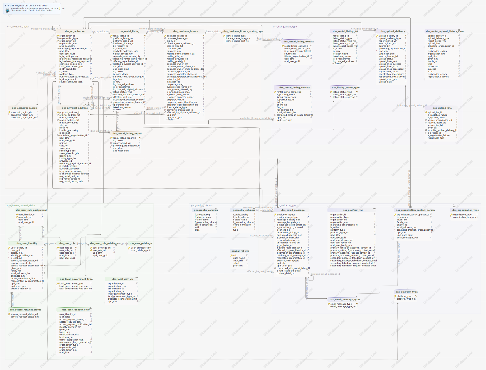

#STR_DSS_Physical_DB_Design_Nov_2025
Generated using [DbSchema](https://dbschema.com)


### Main Diagram



### Table public.dss_access_request_status 
A potential status for a user access request (e.g. Requested, Approved, or Denied)

|Idx |Name |Data Type |Description |
|---|---|---|---|
| * &#128273;  &#11019; | access\_request\_status\_cd| varchar(25)  | System-consistent code for the request status |
| * | access\_request\_status\_nm| varchar(250)  | Business term for the request status |


##### Indexes 
|Type |Name |On |
|---|---|---|
| &#128273;  | dss\_access\_request\_status\_pk | ON access\_request\_status\_cd|


### Table public.dss_business_licence 
|Idx |Name |Data Type |Description |
|---|---|---|---|
| * &#128273;  &#11019; | business\_licence\_id| bigint GENERATED  ALWAYS AS IDENTITY | Unique generated key |
| * &#128269; | business\_licence\_no| varchar(50)  | The local government issued licence number that applies to the rental offering |
| * | expiry\_dt| date  | The date on which the business licence expires |
| &#128270; | physical\_rental\_address\_txt| varchar(250)  | The full physical address of the location that is licenced as a short-term rental business |
|  | licence\_type\_txt| varchar(320)  | Free form description of the type of business licence issued (e.g. short-term rental, bed and breakfast, boarding and lodging, tourist accommodation) |
|  | restriction\_txt| varchar(320)  | Notes related to any restrictions associated with the licence |
|  | business\_nm| varchar(320)  | Official name of the business |
|  | mailing\_street\_address\_txt| varchar(100)  | Street address component of the business mailing address |
|  | mailing\_city\_nm| varchar(100)  | City component of the business mailing address |
|  | mailing\_province\_cd| varchar(2)  | Province component of the business mailing address |
|  | mailing\_postal\_cd| varchar(10)  | Postal code component of the business mailing address |
|  | business\_owner\_nm| varchar(320)  | Full name of the registered business owner |
|  | business\_owner\_phone\_no| varchar(30)  | Phone number of the business owner |
|  | business\_owner\_email\_address\_dsc| varchar(320)  | Email address of the business owner |
|  | business\_operator\_nm| varchar(320)  | Full name of the business operator or property manager |
|  | business\_operator\_phone\_no| varchar(30)  | Phone number of the business operator |
|  | business\_operator\_email\_address\_dsc| varchar(320)  | Email address of the business operator |
|  | infraction\_txt| varchar(320)  | Description of an infraction |
|  | infraction\_dt| date  | The date on which the described infraction occurred |
|  | property\_zone\_txt| varchar(100)  | Description or name of the property zoning |
|  | available\_bedrooms\_qty| smallint  | The number of bedrooms in the dwelling unit that are available for short term rental |
|  | max\_guests\_allowed\_qty| smallint  | The number of guests that can be accommodated |
|  | is\_principal\_residence| boolean  | Indicates whether the short term rental property is a principal residence |
|  | is\_owner\_living\_onsite| boolean  | Indicates whether the owner lives on the property |
|  | is\_owner\_property\_tenant| boolean  | Indicates whether the business owner rents the property |
|  | property\_folio\_no| varchar(30)  | The number used to identify the property |
|  | property\_parcel\_identifier\_no| varchar(30)  | The PID number assigned by the Land Title and Survey Authority that identifies the piece of land |
|  | property\_legal\_description\_txt| varchar(320)  | The physical description of the property as it is registered with the Land Title and Survey Authority |
| * &#128270; &#11016; | licence\_status\_type| varchar(25)  | Foreign key |
| * &#128269; &#11016; | providing\_organization\_id| bigint  | Foreign key |
| &#128270; &#11016; | affected\_by\_physical\_address\_id| bigint  | Foreign key |
| * | upd\_dtm| timestamptz  | Trigger-updated timestamp of last change |
|  | upd\_user\_guid| uuid  | The globally unique identifier (assigned by the identity provider) for the most recent user to record a change |
| &#128270; | regexp\_replace(regexp\_replace(upper((business\_licence\_no)::text), '[^A-Z0-9]+'::text, ''::text, 'g'::text), '^0+'::text, ''::text)| varchar  |  |


##### Indexes 
|Type |Name |On |
|---|---|---|
| &#128273;  | dss\_business\_licence\_pk | ON business\_licence\_id|
| &#128269;  | dss\_business\_licence\_uk | ON providing\_organization\_id, business\_licence\_no|
| &#128270;  | dss\_business\_licence\_i1 | ON licence\_status\_type|
| &#128270;  | dss\_business\_licence\_i2 | ON affected\_by\_physical\_address\_id|
| &#128270;  | dss\_business\_licence\_i3 | ON physical\_rental\_address\_txt|
| &#128270;  | dss\_business\_licence\_i4 | ON regexp\_replace(regexp\_replace(upper((business\_licence\_no)::text), '[^A-Z0-9]+'::text, ''::text, 'g'::text), '^0+'::text, ''::text)|

##### Foreign Keys
|Type |Name |On |
|---|---|---|
|  | dss_business_licence_fk_affecting | ( affected\_by\_physical\_address\_id ) ref [public.dss\_physical\_address](#dss\_physical\_address) (physical\_address\_id) |
|  | dss_business_licence_fk_classified_as | ( licence\_status\_type ) ref [public.dss\_business\_licence\_status\_type](#dss\_business\_licence\_status\_type) (licence\_status\_type) |
|  | dss_business_licence_fk_provided_by | ( providing\_organization\_id ) ref [public.dss\_organization](#dss\_organization) (organization\_id) |


### Table public.dss_business_licence_status_type 
A potential status for a BUSINESS LICENCE (e.g. Pending, Denied, Issued, Suspended, Revoked, Cancelled, Expired)

|Idx |Name |Data Type |Description |
|---|---|---|---|
| * &#128273;  &#11019; | licence\_status\_type| varchar(25)  | System-consistent code for the business licence status (e.g. Pending, Denied, Issued, Suspended, Revoked, Cancelled, Expired) |
| * | licence\_status\_type\_nm| varchar(50)  | Business term for the licence status (e.g. Pending, Denied, Issued, Suspended, Revoked, Cancelled, Expired) |
| * | licence\_status\_sort\_no| smallint  | Relative order in which the business prefers to see the status listed |


##### Indexes 
|Type |Name |On |
|---|---|---|
| &#128273;  | dss\_business\_licence\_status\_type\_pk | ON licence\_status\_type|


### Table public.dss_economic_region 
A geographic classification of LOCAL GOVERNMENT SUBDIVISION used for sorting and grouping of members

|Idx |Name |Data Type |Description |
|---|---|---|---|
| * &#128273;  &#11019; | economic\_region\_dsc| varchar(100)  | System-consistent code (e.g. Northeast, Cariboo) |
| * | economic\_region\_nm| varchar(250)  | Business term for the ECONOMIC REGION (e.g. Northeast, Cariboo) |
|  | economic\_region\_sort\_no| smallint  | Relative order in which the business prefers to see the ECONOMIC REGION listed |


##### Indexes 
|Type |Name |On |
|---|---|---|
| &#128273;  | dss\_economic\_region\_pk | ON economic\_region\_dsc|


### Table public.dss_email_message 
A message that is sent to one or more recipients via email

|Idx |Name |Data Type |Description |
|---|---|---|---|
| * &#128273;  &#11019; | email\_message\_id| bigint GENERATED  ALWAYS AS IDENTITY | Unique generated key |
| * &#11016; | email\_message\_type| varchar(50)  | Foreign key |
| * &#128270; | message\_delivery\_dtm| timestamptz  | A timestamp indicating when the message delivery was initiated |
| * | message\_template\_dsc| varchar(4000)  | The full text or template for the message that is sent |
|  | is\_host\_contacted\_externally| boolean  | Indicates whether the the property host has already been contacted by external means |
| * | is\_submitter\_cc\_required| boolean  | Indicates whether the user initiating the message should receive a copy of the email |
|  | lg\_phone\_no| varchar(30)  | A phone number associated with a Local Government contact |
|  | unreported\_listing\_no| varchar(50)  | The platform issued identification number for the listing (if not included in a rental listing report) |
|  | host\_email\_address\_dsc| varchar(320)  | E-mail address of a short term rental host (directly entered by the user as a message recipient) |
|  | lg\_email\_address\_dsc| varchar(320)  | E-mail address of a local government contact (directly entered by the user as a message recipient) |
|  | cc\_email\_address\_dsc| varchar(4000)  | E-mail address of a secondary message recipient (directly entered by the user) |
|  | unreported\_listing\_url| varchar(4000)  | User-provided URL for a short-term rental platform listing that is the subject of the message |
|  | lg\_str\_bylaw\_url| varchar(4000)  | User-provided URL for a local government bylaw that is the subject of the message |
| &#11016; | initiating\_user\_identity\_id| bigint  | Foreign key |
| &#11016; | affected\_by\_user\_identity\_id| bigint  | Foreign key |
| &#11016; | involved\_in\_organization\_id| bigint  | Foreign key |
| &#11016; | batching\_email\_message\_id| bigint  | Foreign key |
| &#11016; | requesting\_organization\_id| bigint  | Foreign key |
|  | external\_message\_no| varchar(50)  | External identifier for tracking the message delivery progress |
|  | upd\_dtm| timestamptz  | Trigger-updated timestamp of last change |
|  | upd\_user\_guid| uuid  | The globally unique identifier (assigned by the identity provider) for the most recent user to record a change |
| &#128270; &#11016; | concerned\_with\_rental\_listing\_id| bigint  | Foreign key |
|  | is\_with\_standard\_detail| boolean  | Indicates whether message body should include text a block of detail text that is standard for the message type |
|  | custom\_detail\_txt| varchar(4000)  | Free form text that should be included in the message body |


##### Indexes 
|Type |Name |On |
|---|---|---|
| &#128273;  | dss\_email\_message\_pk | ON email\_message\_id|
| &#128270;  | dss\_email\_message\_i1 | ON concerned\_with\_rental\_listing\_id, message\_delivery\_dtm|

##### Foreign Keys
|Type |Name |On |
|---|---|---|
|  | dss_email_message_fk_affecting | ( affected\_by\_user\_identity\_id ) ref [public.dss\_user\_identity](#dss\_user\_identity) (user\_identity\_id) |
|  | dss_email_message_fk_batched_in | ( batching\_email\_message\_id ) ref [public.dss\_email\_message](#dss\_email\_message) (email\_message\_id) |
|  | dss_email_message_fk_communicating | ( email\_message\_type ) ref [public.dss\_email\_message\_type](#dss\_email\_message\_type) (email\_message\_type) |
|  | dss_email_message_fk_included_in | ( concerned\_with\_rental\_listing\_id ) ref [public.dss\_rental\_listing](#dss\_rental\_listing) (rental\_listing\_id) |
|  | dss_email_message_fk_initiated_by | ( initiating\_user\_identity\_id ) ref [public.dss\_user\_identity](#dss\_user\_identity) (user\_identity\_id) |
|  | dss_email_message_fk_involving | ( involved\_in\_organization\_id ) ref [public.dss\_organization](#dss\_organization) (organization\_id) |
|  | dss_email_message_fk_requested_by | ( requesting\_organization\_id ) ref [public.dss\_organization](#dss\_organization) (organization\_id) |


### Table public.dss_email_message_type 
The type or purpose of a system generated message (e.g. Notice of Takedown, Takedown Request, Delisting Warning, Delisting Request, Access Granted Notification, Access Denied Notification)

|Idx |Name |Data Type |Description |
|---|---|---|---|
| * &#128273;  &#11019; | email\_message\_type| varchar(50)  | System-consistent code for the type or purpose of the message (e.g. Notice of Takedown, Takedown Request, Delisting Warning, Delisting Request, Access Granted Notification, Access Denied Notification) |
| * | email\_message\_type\_nm| varchar(250)  | Business term for the type or purpose of the message (e.g. Notice of Takedown, Takedown Request, Delisting Warning, Delisting Request, Access Granted Notification, Access Denied Notification) |


##### Indexes 
|Type |Name |On |
|---|---|---|
| &#128273;  | dss\_email\_message\_type\_pk | ON email\_message\_type|


### Table public.dss_listing_status_type 
A potential status for a CURRENT RENTAL LISTING (e.g. New, Active, Inactive, Reassigned, Taken Down)

|Idx |Name |Data Type |Description |
|---|---|---|---|
| * &#128273;  &#11019; | listing\_status\_type| varchar(2)  | System-consistent code for the listing status (e.g. N, A, I, R, T) |
| * | listing\_status\_type\_nm| varchar(50)  | Business term for the listing status (e.g. New, Active, Inactive, Reassigned, Taken Down) |
| * | listing\_status\_sort\_no| smallint  | Relative order in which the business prefers to see the status listed |


##### Indexes 
|Type |Name |On |
|---|---|---|
| &#128273;  | dss\_listing\_status\_type\_pk | ON listing\_status\_type|


### Table public.dss_local_government_type 
A sub-type of local government organization used for sorting and grouping of members

|Idx |Name |Data Type |Description |
|---|---|---|---|
| * &#128273;  &#11019; | local\_government\_type| varchar(50)  | System-consistent code (e.g. Municipality, First Nations Community) |
| * | local\_government\_type\_nm| varchar(250)  | Business term for for the local government type (e.g. Municipality, First Nations Community) |
|  | local\_government\_type\_sort\_no| smallint  | Relative order in which the business prefers to see the LOCAL GOVERNMENT TYPE listed |


##### Indexes 
|Type |Name |On |
|---|---|---|
| &#128273;  | dss\_local\_government\_type\_pk | ON local\_government\_type|


### Table public.dss_organization 
A private company or governing body component that plays a role in short term rental reporting or enforcement

|Idx |Name |Data Type |Description |
|---|---|---|---|
| * &#128273;  &#11019; | organization\_id| bigint GENERATED  ALWAYS AS IDENTITY | Unique generated key |
| * &#128270; &#11016; | organization\_type| varchar(25)  | Foreign key |
| * &#128269; | organization\_cd| varchar(25)  | An immutable system code that identifies the organization (e.g. CEU, AIRBNB) |
| * | organization\_nm| varchar(250)  | A human-readable name that identifies the organization (e.g. Corporate Enforecement Unit, City of Victoria) |
|  | area\_geometry| varchar  | the multipolygon shape identifying the boundaries of a local government subdivision |
| &#128270; &#11016; | managing\_organization\_id| bigint  | Self-referential hierarchical foreign key |
| * | upd\_dtm| timestamptz  | Trigger-updated timestamp of last change |
| &#11019; | upd\_user\_guid| uuid  | The globally unique identifier (assigned by the identity provider) for the most recent user to record a change |
|  | is\_lg\_participating| boolean  | Indicates whether a LOCAL GOVERNMENT ORGANIZATION participates in Short Term Rental Data Sharing |
|  | is\_principal\_residence\_required| boolean  | Indicates whether a LOCAL GOVERNMENT SUBDIVISION is subject to Provincial Principal Residence Short Term Rental restrictions |
|  | is\_business\_licence\_required| boolean  | Indicates whether a LOCAL GOVERNMENT SUBDIVISION requires a business licence for Short Term Rental operation |
| &#11016; | economic\_region\_dsc| varchar(100)  | Foreign key for a Local Government Subdivision |
| &#11016; | local\_government\_type| varchar(50)  | Foreign key for a LOCAL GOVERNMENT |
|  | is\_str\_prohibited| boolean  | Indicates whether a LOCAL GOVERNMENT SUBDIVISION entirely prohibits short term housing rentals |
|  | is\_active| boolean  | Indicates whether the ORGANIZATION is currently available for new associations |
| &#11016; | platform\_type| varchar(25)  | Foreign key for a RENTAL PLATFORM |
|  | business\_licence\_format\_txt| varchar(50)  | A free form indication of how BUSINESS NUMBER is laid out for a LOCAL GOVERNMENT ORGANIZATION |
|  | is\_straa\_exempt| boolean  | Indicates whether a LOCAL GOVERNMENT SUBDIVISION is exempt from all Provincial Short Term Rental restrictions |
|  | source\_attributes\_json| jsonb  | A JSON object containing non-geometry fields from the Local Government Subdivision information source |


##### Indexes 
|Type |Name |On |
|---|---|---|
| &#128273;  | dss\_organization\_pk | ON organization\_id|
| &#128269;  | dss\_organization\_uk | ON organization\_cd|
| &#128270;  | dss\_organization\_i1 | ON organization\_type|
| &#128270;  | dss\_organization\_i2 | ON managing\_organization\_id|

##### Foreign Keys
|Type |Name |On |
|---|---|---|
| Vir | fk_dss_organization_dss_organization | ( managing\_organization\_id ) ref [public.dss\_organization](#dss\_organization) (organization\_id) |
|  | dss_organization_fk_managed_by | ( managing\_organization\_id ) ref [public.dss\_organization](#dss\_organization) (organization\_id) |
|  | dss_organization_fk_treated_as | ( organization\_type ) ref [public.dss\_organization\_type](#dss\_organization\_type) (organization\_type) |
|  | dss_organization_fk_classified_as | ( platform\_type ) ref [public.dss\_platform\_type](#dss\_platform\_type) (platform\_type) |
|  | dss_organization_fk_administered_as | ( local\_government\_type ) ref [public.dss\_local\_government\_type](#dss\_local\_government\_type) (local\_government\_type) |
|  | dss_organization_fk_within | ( economic\_region\_dsc ) ref [public.dss\_economic\_region](#dss\_economic\_region) (economic\_region\_dsc) |


### Table public.dss_organization_contact_person 
A person who has been identified as a notable contact for a particular organization

|Idx |Name |Data Type |Description |
|---|---|---|---|
| * &#128273;  | organization\_contact\_person\_id| bigint GENERATED  ALWAYS AS IDENTITY | Unique generated key |
|  | is\_primary| boolean  | Indicates whether the contact should receive all communications directed at the organization |
|  | given\_nm| varchar(25)  | A name given to a person so that they can easily be identified among their family members (in some cultures, this is often the first name) |
|  | family\_nm| varchar(25)  | A name that is often shared amongst members of the same family (commonly known as a surname within some cultures) |
|  | phone\_no| varchar(30)  | Phone number given for the contact by the organization (contains only digits) |
| * | email\_address\_dsc| varchar(320)  | E-mail address given for the contact by the organization |
| * &#11016; | contacted\_through\_organization\_id| bigint  | Foreign key |
| * | upd\_dtm| timestamptz  | Trigger-updated timestamp of last change |
|  | upd\_user\_guid| uuid  | The globally unique identifier (assigned by the identity provider) for the most recent user to record a change |
| &#11016; | email\_message\_type| varchar(50)  | Foreign key |


##### Indexes 
|Type |Name |On |
|---|---|---|
| &#128273;  | dss\_organization\_contact\_person\_pk | ON organization\_contact\_person\_id|

##### Foreign Keys
|Type |Name |On |
|---|---|---|
|  | dss_organization_contact_person_fk_contacted_for | ( contacted\_through\_organization\_id ) ref [public.dss\_organization](#dss\_organization) (organization\_id) |
|  | dss_organization_contact_person_fk_subscribed_to | ( email\_message\_type ) ref [public.dss\_email\_message\_type](#dss\_email\_message\_type) (email\_message\_type) |


### Table public.dss_organization_type 
A level of government or business category

|Idx |Name |Data Type |Description |
|---|---|---|---|
| * &#128273;  &#11019; | organization\_type| varchar(25)  | System-consistent code for a level of government or business category |
| * | organization\_type\_nm| varchar(250)  | Business term for a level of government or business category |


##### Indexes 
|Type |Name |On |
|---|---|---|
| &#128273;  | dss\_organization\_type\_pk | ON organization\_type|


### Table public.dss_physical_address 
A property address that includes any verifiable BC attributes

|Idx |Name |Data Type |Description |
|---|---|---|---|
| * &#128273;  &#11019; | physical\_address\_id| bigint GENERATED  ALWAYS AS IDENTITY | Unique generated key |
| * &#128270; | original\_address\_txt| varchar(250)  | The source-provided address of a short-term rental offering |
|  | match\_result\_json| json  | Full JSON result of the source address matching attempt |
| &#128270; | match\_address\_txt| varchar(250)  | The sanitized physical address (returned as fullAddress) that has been derived from the original |
|  | match\_score\_amt| smallint  | The relative score returned from the address matching attempt |
|  | site\_no| varchar(50)  | The siteID returned by the address match |
|  | block\_no| varchar(50)  | The blockID returned by the address match |
|  | location\_geometry| varchar  | The computed location point of the matched address |
|  | is\_exempt| boolean  | Indicates whether the address has been identified as exempt from Short Term Rental regulations |
| &#128270; &#11016; | containing\_organization\_id| bigint  | Foreign key |
| * | upd\_dtm| timestamptz  | Trigger-updated timestamp of last change |
|  | upd\_user\_guid| uuid  | The globally unique identifier (assigned by the identity provider) for the most recent user to record a change |
|  | unit\_no| varchar(50)  | The unitNumber (suite) returned by the address match (e.g. 100) |
|  | civic\_no| varchar(50)  | The civicNumber (building number) returned by the address match (e.g. 1285) |
|  | street\_nm| varchar(100)  | The streetName returned by the address match (e.g. Pender) |
|  | street\_type\_dsc| varchar(50)  | The streetType returned by the address match (e.g. St or Street) |
|  | street\_direction\_dsc| varchar(50)  | The streetDirection returned by the address match (e.g. W or West) |
|  | locality\_nm| varchar(100)  | The localityName (community) returned by the address match (e.g. Vancouver) |
|  | locality\_type\_dsc| varchar(50)  | The localityType returned by the address match (e.g. City) |
|  | province\_cd| varchar(5)  | The provinceCode returned by the address match |
| &#11016; | replacing\_physical\_address\_id| bigint  | Foreign key |
|  | is\_match\_verified| boolean  | Indicates whether the matched address has been verified as correct for the listing by the responsible authorities |
|  | is\_match\_corrected| boolean  | Indicates whether the matched address has been manually changed to one that is verified as correct for the listing |
|  | is\_system\_processing| boolean  | Indicates whether the physical address is being processed by the system and may not yet be in its final form |
|  | is\_changed\_original\_address| boolean  | Indicates whether the original address has received a different property address from the platform in the last reporting period |
|  | reg\_rental\_unit\_no| varchar(50)  | The rental property unit number used to validate the bc registry number |
|  | reg\_rental\_street\_no| varchar(50)  | The rental property street number used to validate the bc registry number |
|  | reg\_rental\_postal\_code| varchar(7)  | The rental property postal code number used to validate the bc registry number |


##### Indexes 
|Type |Name |On |
|---|---|---|
| &#128273;  | dss\_physical\_address\_pk | ON physical\_address\_id|
| &#128270;  | dss\_physical\_address\_i1 | ON original\_address\_txt|
| &#128270;  | dss\_physical\_address\_i2 | ON match\_address\_txt|
| &#128270;  | dss\_physical\_address\_i3 | ON containing\_organization\_id|

##### Foreign Keys
|Type |Name |On |
|---|---|---|
| Vir | fk_dss_physical_address_dss_organization | ( containing\_organization\_id ) ref [public.dss\_organization](#dss\_organization) (organization\_id) |
|  | dss_physical_address_fk_contained_in | ( containing\_organization\_id ) ref [public.dss\_organization](#dss\_organization) (organization\_id) |
|  | dss_physical_address_fk_replaced_by | ( replacing\_physical\_address\_id ) ref [public.dss\_physical\_address](#dss\_physical\_address) (physical\_address\_id) |


### Table public.dss_platform_type 
A sub-type of rental platform organization used for sorting and grouping of members

|Idx |Name |Data Type |Description |
|---|---|---|---|
| * &#128273;  &#11019; | platform\_type| varchar(25)  | System-consistent code (e.g. Major/Minor) |
| * | platform\_type\_nm| varchar(250)  | Business term for the platform type (e.g. Major/Minor) |


##### Indexes 
|Type |Name |On |
|---|---|---|
| &#128273;  | dss\_platform\_type\_pk | ON platform\_type|


### Table public.dss_rental_listing 
A rental listing snapshot that is either relevant to a specific monthly report, or is the current, master version

|Idx |Name |Data Type |Description |
|---|---|---|---|
| * &#128273;  &#11019; | rental\_listing\_id| bigint GENERATED  ALWAYS AS IDENTITY | Unique generated key |
| * &#128270; | platform\_listing\_no| varchar(50)  | The platform issued identification number for the listing |
|  | platform\_listing\_url| varchar(4000)  | URL for the short-term rental platform listing |
| &#128270; | business\_licence\_no| varchar(320)  | The business licence number that is published for the rental offering |
|  | bc\_registry\_no| varchar(50)  | The Short Term Registry issued permit number |
|  | is\_entire\_unit| boolean  | Indicates whether the entire dwelling unit is offered for rental (as opposed to a single bedroom) |
|  | available\_bedrooms\_qty| smallint  | The number of bedrooms in the dwelling unit that are available for short term rental |
|  | nights\_booked\_qty| smallint  | The number of nights that short term rental accommodation services were provided during the reporting period |
|  | separate\_reservations\_qty| smallint  | The number of separate reservations that were taken during the reporting period |
| &#128270; &#11016; | including\_rental\_listing\_report\_id| bigint  | Foreign key |
| * &#128270; &#11016; | offering\_organization\_id| bigint  | Foreign key |
| &#128270; &#11016; | locating\_physical\_address\_id| bigint  | Foreign key |
| * | upd\_dtm| timestamptz  | Trigger-updated timestamp of last change |
|  | upd\_user\_guid| uuid  | The globally unique identifier (assigned by the identity provider) for the most recent user to record a change |
| * | is\_current| boolean  | Indicates whether the RENTAL LISTING VERSION is a CURRENT RENTAL LISTING (if it is a copy of the most current REPORTED RENTAL LISTING (having the same listing number for the same offering platform) |
|  | is\_taken\_down| boolean  | Indicates whether a CURRENT RENTAL LISTING has been reported as taken down by the offering platform |
| &#128270; &#11016; | derived\_from\_rental\_listing\_id| bigint  | Foreign key |
|  | is\_active| boolean  | Indicates whether a CURRENT RENTAL LISTING was included in the most recent RENTAL LISTING REPORT |
|  | is\_new| boolean  | Indicates whether a CURRENT RENTAL LISTING appeared for the first time in the last reporting period |
|  | is\_changed\_address| boolean  | Indicates whether a CURRENT RENTAL LISTING has been subjected to address match changes by a user |
|  | is\_lg\_transferred| boolean  | Indicates whether a CURRENT RENTAL LISTING has been transferred to a different Local Goverment Organization as a result of address changes |
|  | is\_changed\_original\_address| boolean  | Indicates whether a CURRENT RENTAL LISTING has received a different property address in the last reporting period |
| &#128270; &#11016; | listing\_status\_type| varchar(2)  | Foreign key |
| &#128270; | effective\_business\_licence\_no| varchar(320)  | The local government issued licence number that should be used for compariing the rental offering with others |
| &#128270; | effective\_host\_nm| varchar(320)  | The full name of the rental offering host that should be used for comparison with others |
|  | is\_changed\_business\_licence| boolean  | Indicates whether a CURRENT RENTAL LISTING has been subjected to business licence linking changes by a user |
| &#128270; &#11016; | governing\_business\_licence\_id| bigint  | Foreign key |
| &#128270; | lg\_transfer\_dtm| timestamptz  | Indicates when a CURRENT RENTAL LISTING was most recently transferred to a different Local Goverment Organization as a result of address changes |
|  | takedown\_reason| varchar(50)  | Provides the reason why the listing was taken down |
| &#128270; | regexp\_replace(regexp\_replace(upper((business\_licence\_no)::text), '[^A-Z0-9]+'::text, ''::text, 'g'::text), '^0+'::text, ''::text)| varchar  |  |


##### Indexes 
|Type |Name |On |
|---|---|---|
| &#128273;  | dss\_rental\_listing\_pk | ON rental\_listing\_id|
| &#128270;  | dss\_rental\_listing\_i1 | ON offering\_organization\_id, platform\_listing\_no|
| &#128270;  | dss\_rental\_listing\_i2 | ON including\_rental\_listing\_report\_id|
| &#128270;  | dss\_rental\_listing\_i3 | ON derived\_from\_rental\_listing\_id|
| &#128270;  | dss\_rental\_listing\_i4 | ON locating\_physical\_address\_id|
| &#128270;  | dss\_rental\_listing\_i5 | ON listing\_status\_type, offering\_organization\_id|
| &#128270;  | dss\_rental\_listing\_i6 | ON governing\_business\_licence\_id|
| &#128270;  | dss\_rental\_listing\_i7 | ON business\_licence\_no|
| &#128270;  | dss\_rental\_listing\_i8 | ON effective\_business\_licence\_no|
| &#128270;  | dss\_rental\_listing\_i9 | ON effective\_host\_nm|
| &#128270;  | dss\_rental\_listing\_i11 | ON lg\_transfer\_dtm|
| &#128270;  | dss\_rental\_listing\_i10 | ON regexp\_replace(regexp\_replace(upper((business\_licence\_no)::text), '[^A-Z0-9]+'::text, ''::text, 'g'::text), '^0+'::text, ''::text)|

##### Foreign Keys
|Type |Name |On |
|---|---|---|
| Vir | fk_dss_rental_listing_dss_rental_listing_report | ( including\_rental\_listing\_report\_id ) ref [public.dss\_rental\_listing\_report](#dss\_rental\_listing\_report) (rental\_listing\_report\_id) |
| Vir | fk_dss_rental_listing_dss_organization | ( offering\_organization\_id ) ref [public.dss\_organization](#dss\_organization) (organization\_id) |
| Vir | fk_dss_rental_listing_dss_physical_address | ( locating\_physical\_address\_id ) ref [public.dss\_physical\_address](#dss\_physical\_address) (physical\_address\_id) |
| Vir | fk_dss_rental_listing_dss_business_licence | ( governing\_business\_licence\_id ) ref [public.dss\_business\_licence](#dss\_business\_licence) (business\_licence\_id) |
|  | dss_rental_listing_fk_classified_as | ( listing\_status\_type ) ref [public.dss\_listing\_status\_type](#dss\_listing\_status\_type) (listing\_status\_type) |
|  | dss_rental_listing_fk_generating | ( derived\_from\_rental\_listing\_id ) ref [public.dss\_rental\_listing](#dss\_rental\_listing) (rental\_listing\_id) |
|  | dss_rental_listing_fk_governed_by | ( governing\_business\_licence\_id ) ref [public.dss\_business\_licence](#dss\_business\_licence) (business\_licence\_id) |
|  | dss_rental_listing_fk_included_in | ( including\_rental\_listing\_report\_id ) ref [public.dss\_rental\_listing\_report](#dss\_rental\_listing\_report) (rental\_listing\_report\_id) |
|  | dss_rental_listing_fk_located_at | ( locating\_physical\_address\_id ) ref [public.dss\_physical\_address](#dss\_physical\_address) (physical\_address\_id) |
|  | dss_rental_listing_fk_offered_by | ( offering\_organization\_id ) ref [public.dss\_organization](#dss\_organization) (organization\_id) |
| Vir | fk_dss_rental_listing_dss_rental_listing | ( offering\_organization\_id ) ref [public.dss\_rental\_listing](#dss\_rental\_listing) (offering\_organization\_id) |


### Table public.dss_rental_listing_contact 
A person who has been identified as a notable contact for a particular rental listing

|Idx |Name |Data Type |Description |
|---|---|---|---|
| * &#128273;  | rental\_listing\_contact\_id| bigint GENERATED  ALWAYS AS IDENTITY | Unique generated key |
| * | is\_property\_owner| boolean  | Indicates a person with the legal right to the unit being short-term rental |
|  | listing\_contact\_nbr| smallint  | Indicates which of the five possible supplier hosts is represented by this contact |
|  | supplier\_host\_no| varchar(50)  | The platform identifier for the supplier host |
|  | full\_nm| varchar(320)  | The full name of the contact person as included in the listing |
|  | phone\_no| varchar(30)  | Phone number given for the contact |
|  | fax\_no| varchar(30)  | Facsimile numbrer given for the contact |
|  | full\_address\_txt| varchar(250)  | Mailing address given for the contact |
|  | email\_address\_dsc| varchar(320)  | E-mail address given for the contact |
| * &#128270; &#11016; | contacted\_through\_rental\_listing\_id| bigint  | Foreign key |
| * | upd\_dtm| timestamptz  | Trigger-updated timestamp of last change |
|  | upd\_user\_guid| uuid  | The globally unique identifier (assigned by the identity provider) for the most recent user to record a change |


##### Indexes 
|Type |Name |On |
|---|---|---|
| &#128273;  | dss\_rental\_listing\_contact\_pk | ON rental\_listing\_contact\_id|
| &#128270;  | dss\_rental\_listing\_contact\_i1 | ON contacted\_through\_rental\_listing\_id|

##### Foreign Keys
|Type |Name |On |
|---|---|---|
|  | dss_rental_listing_contact_fk_contacted_for | ( contacted\_through\_rental\_listing\_id ) ref [public.dss\_rental\_listing](#dss\_rental\_listing) (rental\_listing\_id) |


### Table public.dss_rental_listing_extract 
A prebuilt report that is specific to a subset of rental listings

|Idx |Name |Data Type |Description |
|---|---|---|---|
| * &#128273;  | rental\_listing\_extract\_id| bigint GENERATED  ALWAYS AS IDENTITY | Unique generated key |
| * | rental\_listing\_extract\_nm| varchar(250)  | A description of the information contained in the extract |
| * | is\_pr\_requirement\_filtered| boolean  | Indicates whether the report is filtered by jurisdictional principal residence requirement |
|  | source\_bin| bytea  | The binary image of the information in the report |
| &#11016; | filtering\_organization\_id| bigint  | Foreign key |
| * | upd\_dtm| timestamptz  | Trigger-updated timestamp of last change |
|  | upd\_user\_guid| uuid  | The globally unique identifier (assigned by the identity provider) for the most recent user to record a change |


##### Indexes 
|Type |Name |On |
|---|---|---|
| &#128273;  | dss\_rental\_listing\_extract\_pk | ON rental\_listing\_extract\_id|

##### Foreign Keys
|Type |Name |On |
|---|---|---|
|  | dss_rental_listing_extract_fk_filtered_by | ( filtering\_organization\_id ) ref [public.dss\_organization](#dss\_organization) (organization\_id) |


### Table public.dss_rental_listing_report 
A platform-specific collection of rental listing information that is relevant to a specific month

|Idx |Name |Data Type |Description |
|---|---|---|---|
| * &#128273;  &#11019; | rental\_listing\_report\_id| bigint GENERATED  ALWAYS AS IDENTITY | Unique generated key |
| * | is\_current| boolean  | Indicates whether the rental listing version is the most recent one reported by the platform |
| * &#128269; | report\_period\_ym| date  | The month to which the listing information is relevant (always set to the first day of the month) |
| * &#128269; &#11016; | providing\_organization\_id| bigint  | Foreign key |
| * | upd\_dtm| timestamptz  | Trigger-updated timestamp of last change |
|  | upd\_user\_guid| uuid  | The globally unique identifier (assigned by the identity provider) for the most recent user to record a change |


##### Indexes 
|Type |Name |On |
|---|---|---|
| &#128273;  | dss\_rental\_listing\_report\_pk | ON rental\_listing\_report\_id|
| &#128269;  | dss\_rental\_listing\_report\_uk | ON providing\_organization\_id, report\_period\_ym|

##### Foreign Keys
|Type |Name |On |
|---|---|---|
|  | dss_rental_listing_report_fk_provided_by | ( providing\_organization\_id ) ref [public.dss\_organization](#dss\_organization) (organization\_id) |


### Table public.dss_upload_delivery 
A delivery of uploaded information that is relevant to a specific month

|Idx |Name |Data Type |Description |
|---|---|---|---|
| * &#128273;  &#11019; | upload\_delivery\_id| bigint GENERATED  ALWAYS AS IDENTITY | Unique generated key |
| * | upload\_delivery\_type| varchar(25)  | Identifies the treatment applied to ingesting the uploaded information |
|  | report\_period\_ym| date  | The month to which the delivery batch is relevant (always set to the first day of the month) |
| * | source\_hash\_dsc| varchar(256)  | The hash value of the information that was uploaded |
|  | source\_bin| bytea  | The binary image of the information that was uploaded |
| * &#11016; | providing\_organization\_id| bigint  | Foreign key |
| * | upd\_dtm| timestamptz  | Trigger-updated timestamp of last change |
|  | upd\_user\_guid| uuid  | The globally unique identifier (assigned by the identity provider) for the most recent user to record a change |
|  | source\_header\_txt| varchar(32000)  | Full text of the header line |
|  | upload\_status| varchar(20)  | The current processing status of the uploaded file: Pending, Processed, or Failed |
|  | upload\_lines\_total| integer  | The total number of lines in the uploaded file |
|  | upload\_lines\_success| integer  | The number of lines int the uploaded file that successfully processed |
|  | upload\_lines\_error| integer  | The number of lines in the uploaded file that failed to process |
|  | upload\_lines\_processed| integer  | The number of lines in the uploaded file that were processed |
|  | registration\_status| varchar(20)  | The current processing status of the registration validation: Pending, Processed, or Failed |
|  | registration\_lines\_failure| integer  | The number of lines in the uploaded file that failed to validate the registration number |
|  | registration\_lines\_success| integer  | The number of lines in the uploaded file that successfully validated the registration number |
| &#11016; | upload\_user\_guid| uuid  | The globally unique identifier (assigned by the identity provider) for the user who uploaded the file |
|  | upload\_date| timestamptz  | Date and time the file was uploaded |


##### Indexes 
|Type |Name |On |
|---|---|---|
| &#128273;  | dss\_upload\_delivery\_pk | ON upload\_delivery\_id|

##### Foreign Keys
|Type |Name |On |
|---|---|---|
| Vir | fk_dss_upload_delivery_dss_user_identity | ( upload\_user\_guid ) ref [public.dss\_user\_identity](#dss\_user\_identity) (user\_guid) |
| Vir | fk_dss_upload_delivery_dss_organization | ( providing\_organization\_id ) ref [public.dss\_organization](#dss\_organization) (organization\_id) |
|  | dss_upload_delivery_fk_provided_by | ( providing\_organization\_id ) ref [public.dss\_organization](#dss\_organization) (organization\_id) |


### Table public.dss_upload_line 
An upload delivery line that has been extracted from the source

|Idx |Name |Data Type |Description |
|---|---|---|---|
| * &#128273;  | upload\_line\_id| bigint GENERATED  ALWAYS AS IDENTITY | Unique generated key |
| * | is\_validation\_failure| boolean  | Indicates that there has been a validation problem that prevents successful ingestion of the upload line |
| * | is\_system\_failure| boolean  | Indicates that a system fault has prevented complete ingestion of the upload line |
| * &#128269; | source\_organization\_cd| varchar(25)  | An immutable system code identifying the organization who created the information in the upload line (e.g. AIRBNB) |
| * &#128269; | source\_record\_no| varchar(50)  | The immutable identification number for the source record, such as a rental listing number |
| * | source\_line\_txt| varchar(32000)  | Full text of the upload line |
|  | error\_txt| varchar(32000)  | Freeform description of the problem found while attempting to interpret the report line |
| * &#128269; &#11016; | including\_upload\_delivery\_id| bigint  | Foreign key |
| * &#128270; | is\_processed| boolean  | Indicates that no further ingestion attempt is required for the upload line |
|  | is\_registration\_failure| boolean  DEFAULT false | Indicates that there has been a problem validating the reg no, or determining if the property is straa exempt |
|  | registration\_text| varchar(32000)  | Freeform description of the problem found while attempting to validate the reg no, or determine if the property is straa exempt |


##### Indexes 
|Type |Name |On |
|---|---|---|
| &#128273;  | dss\_upload\_line\_pk | ON upload\_line\_id|
| &#128269;  | dss\_upload\_line\_uk | ON including\_upload\_delivery\_id, source\_organization\_cd, source\_record\_no|
| &#128270;  | dss\_upload\_line\_i1 | ON is\_processed, including\_upload\_delivery\_id|

##### Foreign Keys
|Type |Name |On |
|---|---|---|
|  | dss_upload_line_fk_included_in | ( including\_upload\_delivery\_id ) ref [public.dss\_upload\_delivery](#dss\_upload\_delivery) (upload\_delivery\_id) |


### Table public.dss_user_identity 
An externally defined domain directory object representing a potential application user or group

|Idx |Name |Data Type |Description |
|---|---|---|---|
| * &#128273;  &#11019; | user\_identity\_id| bigint GENERATED  ALWAYS AS IDENTITY | Unique generated key |
| * &#11016; | user\_guid| uuid  | An immutable unique identifier assigned by the identity provider |
| * | display\_nm| varchar(250)  | A human-readable full name that is assigned by the identity provider (this may include a preferred name and/or business unit name) |
| * | identity\_provider\_nm| varchar(25)  | A directory or domain that authenticates system users to allow access to the application or its API  (e.g. idir, bceidbusiness) |
| * | is\_enabled| boolean  | Indicates whether access is currently permitted using this identity |
| * &#11016; | access\_request\_status\_cd| varchar(25)  | The current status of the most recent access request made by the user (restricted to Requested, Approved, or Denied) |
|  | access\_request\_dtm| timestamptz  | A timestamp indicating when the most recent access request was made by the user |
|  | access\_request\_justification\_txt| varchar(250)  | The most recent user-provided reason for requesting application access |
|  | given\_nm| varchar(25)  | A name given to a person so that they can easily be identified among their family members (in some cultures, this is often the first name) |
|  | family\_nm| varchar(25)  | A name that is often shared amongst members of the same family (commonly known as a surname within some cultures) |
|  | email\_address\_dsc| varchar(320)  | E-mail address associated with the user by the identity provider |
|  | business\_nm| varchar(250)  | A human-readable organization name that is associated with the user by the identity provider |
|  | terms\_acceptance\_dtm| timestamptz  | A timestamp indicating when the user most recently accepted the published Terms and Conditions of application access |
| &#11016; | represented\_by\_organization\_id| bigint  | Foreign key |
| * | upd\_dtm| timestamptz  | Trigger-updated timestamp of last change |
|  | upd\_user\_guid| uuid  | The globally unique identifier (assigned by the identity provider) for the most recent user to record a change |
|  | external\_identity\_cd| varchar(100)  | A non-guid unique identifier assigned by the identity provider |


##### Indexes 
|Type |Name |On |
|---|---|---|
| &#128273;  | dss\_user\_identity\_pk | ON user\_identity\_id|

##### Foreign Keys
|Type |Name |On |
|---|---|---|
| Vir | fk_dss_user_identity_dss_organization | ( user\_guid ) ref [public.dss\_organization](#dss\_organization) (upd\_user\_guid) |
| Vir | fk_dss_user_identity_dss_organization_001 | ( represented\_by\_organization\_id ) ref [public.dss\_organization](#dss\_organization) (organization\_id) |
|  | dss_user_identity_fk_given | ( access\_request\_status\_cd ) ref [public.dss\_access\_request\_status](#dss\_access\_request\_status) (access\_request\_status\_cd) |
|  | dss_user_identity_fk_representing | ( represented\_by\_organization\_id ) ref [public.dss\_organization](#dss\_organization) (organization\_id) |


### Table public.dss_user_privilege 
A granular access right or privilege within the application that may be granted to a role

|Idx |Name |Data Type |Description |
|---|---|---|---|
| * &#128273;  &#11019; | user\_privilege\_cd| varchar(25)  | The immutable system code that identifies the privilege |
| * | user\_privilege\_nm| varchar(250)  | The human-readable name that is given for the role |


##### Indexes 
|Type |Name |On |
|---|---|---|
| &#128273;  | dss\_user\_privilege\_pk | ON user\_privilege\_cd|


### Table public.dss_user_role 
A set of access rights and privileges within the application that may be granted to users

|Idx |Name |Data Type |Description |
|---|---|---|---|
| * &#128273;  &#11019; | user\_role\_cd| varchar(25)  | The immutable system code that identifies the role |
| * | user\_role\_nm| varchar(250)  | The human-readable name that is given for the role |
|  | user\_role\_dsc| varchar(200)  | The human-readable description that is given for the role |
|  | upd\_dtm| timestamptz  | Trigger-updated timestamp of last change |
|  | upd\_user\_guid| uuid  | The globally unique identifier (assigned by the identity provider) for the most recent user to record a change |


##### Indexes 
|Type |Name |On |
|---|---|---|
| &#128273;  | dss\_user\_role\_pk | ON user\_role\_cd|


### Table public.dss_user_role_assignment 
The association of a grantee credential to a role for the purpose of conveying application privileges

|Idx |Name |Data Type |Description |
|---|---|---|---|
| * &#128273;  &#11016; | user\_identity\_id| bigint  | Foreign key |
| * &#128273;  &#11016; | user\_role\_cd| varchar(25)  | Foreign key |
|  | upd\_dtm| timestamptz  | Trigger-updated timestamp of last change |
|  | upd\_user\_guid| uuid  | The globally unique identifier (assigned by the identity provider) for the most recent user to record a change |


##### Indexes 
|Type |Name |On |
|---|---|---|
| &#128273;  | dss\_user\_role\_assignment\_pk | ON user\_identity\_id, user\_role\_cd|

##### Foreign Keys
|Type |Name |On |
|---|---|---|
|  | dss_user_role_assignment_fk_granted | ( user\_role\_cd ) ref [public.dss\_user\_role](#dss\_user\_role) (user\_role\_cd) |
|  | dss_user_role_assignment_fk_granted_to | ( user\_identity\_id ) ref [public.dss\_user\_identity](#dss\_user\_identity) (user\_identity\_id) |


### Table public.dss_user_role_privilege 
The association of a granular application privilege to a role

|Idx |Name |Data Type |Description |
|---|---|---|---|
| * &#128273;  &#11016; | user\_privilege\_cd| varchar(25)  | Foreign key |
| * &#128273;  &#11016; | user\_role\_cd| varchar(25)  | Foreign key |
|  | upd\_dtm| timestamptz  | Trigger-updated timestamp of last change |
|  | upd\_user\_guid| uuid  | The globally unique identifier (assigned by the identity provider) for the most recent user to record a change |


##### Indexes 
|Type |Name |On |
|---|---|---|
| &#128273;  | dss\_user\_role\_privilege\_pk | ON user\_privilege\_cd, user\_role\_cd|

##### Foreign Keys
|Type |Name |On |
|---|---|---|
|  | dss_user_role_privilege_fk_conferred_by | ( user\_role\_cd ) ref [public.dss\_user\_role](#dss\_user\_role) (user\_role\_cd) |
|  | dss_user_role_privilege_fk_conferring | ( user\_privilege\_cd ) ref [public.dss\_user\_privilege](#dss\_user\_privilege) (user\_privilege\_cd) |


### Table public.spatial_ref_sys 
|Idx |Name |Data Type |
|---|---|---|
| * &#128273;  | srid| integer  |
|  | auth\_name| varchar(256)  |
|  | auth\_srid| integer  |
|  | srtext| varchar(2048)  |
|  | proj4text| varchar(2048)  |


##### Indexes 
|Type |Name |On |
|---|---|---|
| &#128273;  | spatial\_ref\_sys\_pkey | ON srid|

##### Constraints
|Name |Definition |
|---|---|
| spatial_ref_sys_srid_check | srid &gt; 0) AND (srid &lt;= 998999 |


## View dss_local_gov_vw

Query dss_local_gov_vw
```
CREATE OR REPLACE VIEW ${nameWithSchemaName} AS SELECT ${view},
    do2.organization\_type,
    do2.organization\_cd,
    do2.organization\_nm,
    do2.local\_government\_type,
    lgt.local\_government\_type\_nm,
    do2.business\_licence\_format\_txt,
    do2.upd\_dtm
   FROM (dss\_organization do2
     LEFT JOIN dss\_local\_government\_type lgt ON (((lgt.local\_government\_type)::text = (do2.local\_government\_type)::text)))
  WHERE ((do2.organization\_type)::text = 'LG'::text)
 SELECT do2.organization\_id,
    do2.organization\_type,
    do2.organization\_cd,
    do2.organization\_nm,
    do2.local\_government\_type,
    lgt.local\_government\_type\_nm,
    do2.business\_licence\_format\_txt,
    do2.upd\_dtm
   FROM (dss\_organization do2
     LEFT JOIN dss\_local\_government\_type lgt ON (((lgt.local\_government\_type)::text = (do2.local\_government\_type)::text)))
  WHERE ((do2.organization\_type)::text = 'LG'::text)
```

|Idx |Name |Type |
|---|---|---|
|  | organization\_id| bigint  |
|  | organization\_type| varchar(25)  |
|  | organization\_cd| varchar(25)  |
|  | organization\_nm| varchar(250)  |
|  | local\_government\_type| varchar(50)  |
|  | local\_government\_type\_nm| varchar(250)  |
|  | business\_licence\_format\_txt| varchar(50)  |
|  | upd\_dtm| timestamptz  |


## View dss_platform_vw

Query dss_platform_vw
```
CREATE OR REPLACE VIEW ${nameWithSchemaName} AS SELECT ${view},
    do2.organization\_type,
    do2.organization\_cd,
    do2.organization\_nm,
    do2.managing\_organization\_id,
    do2.is\_active,
    do2.platform\_type,
    dpt.platform\_type\_nm,
    do2.upd\_dtm,
    do2.upd\_user\_guid,
    dui.display\_nm AS upd\_user\_display\_nm,
    dui.display\_nm AS upd\_user\_given\_nm,
    dui.display\_nm AS upd\_user\_family\_nm,
    docp.organization\_contact\_person\_id AS primary\_notice\_of\_takedown\_contact\_id,
    docp.email\_address\_dsc AS primary\_notice\_of\_takedown\_contact\_email,
    docp2.organization\_contact\_person\_id AS primary\_takedown\_request\_contact\_id,
    docp2.email\_address\_dsc AS primary\_takedown\_request\_contact\_email,
    docp3.organization\_contact\_person\_id AS secondary\_notice\_of\_takedown\_contact\_id,
    docp3.email\_address\_dsc AS secondary\_notice\_of\_takedown\_contact\_email,
    docp4.organization\_contact\_person\_id AS secondary\_takedown\_request\_contact\_id,
    docp4.email\_address\_dsc AS secondary\_takedown\_request\_contact\_email
   FROM ((((((dss\_organization do2
     LEFT JOIN dss\_platform\_type dpt ON (((dpt.platform\_type)::text = (do2.platform\_type)::text)))
     LEFT JOIN dss\_user\_identity dui ON ((dui.user\_guid = do2.upd\_user\_guid)))
     LEFT JOIN dss\_organization\_contact\_person docp ON (((docp.contacted\_through\_organization\_id = ${view}) AND ((docp.email\_message\_type)::text = 'Notice of Takedown'::text) AND (docp.is\_primary = true))))
     LEFT JOIN dss\_organization\_contact\_person docp2 ON (((docp2.contacted\_through\_organization\_id = ${view}) AND ((docp2.email\_message\_type)::text = 'Takedown Request'::text) AND (docp2.is\_primary = true))))
     LEFT JOIN dss\_organization\_contact\_person docp3 ON (((docp3.contacted\_through\_organization\_id = ${view}) AND ((docp3.email\_message\_type)::text = 'Notice of Takedown'::text) AND (docp3.is\_primary &lt;&gt; true))))
     LEFT JOIN dss\_organization\_contact\_person docp4 ON (((docp4.contacted\_through\_organization\_id = ${view}) AND ((docp4.email\_message\_type)::text = 'Takedown Request'::text) AND (docp4.is\_primary &lt;&gt; true))))
  WHERE ((do2.organization\_type)::text = 'Platform'::text)
 SELECT do2.organization\_id,
    do2.organization\_type,
    do2.organization\_cd,
    do2.organization\_nm,
    do2.managing\_organization\_id,
    do2.is\_active,
    do2.platform\_type,
    dpt.platform\_type\_nm,
    do2.upd\_dtm,
    do2.upd\_user\_guid,
    dui.display\_nm AS upd\_user\_display\_nm,
    dui.display\_nm AS upd\_user\_given\_nm,
    dui.display\_nm AS upd\_user\_family\_nm,
    docp.organization\_contact\_person\_id AS primary\_notice\_of\_takedown\_contact\_id,
    docp.email\_address\_dsc AS primary\_notice\_of\_takedown\_contact\_email,
    docp2.organization\_contact\_person\_id AS primary\_takedown\_request\_contact\_id,
    docp2.email\_address\_dsc AS primary\_takedown\_request\_contact\_email,
    docp3.organization\_contact\_person\_id AS secondary\_notice\_of\_takedown\_contact\_id,
    docp3.email\_address\_dsc AS secondary\_notice\_of\_takedown\_contact\_email,
    docp4.organization\_contact\_person\_id AS secondary\_takedown\_request\_contact\_id,
    docp4.email\_address\_dsc AS secondary\_takedown\_request\_contact\_email
   FROM ((((((dss\_organization do2
     LEFT JOIN dss\_platform\_type dpt ON (((dpt.platform\_type)::text = (do2.platform\_type)::text)))
     LEFT JOIN dss\_user\_identity dui ON ((dui.user\_guid = do2.upd\_user\_guid)))
     LEFT JOIN dss\_organization\_contact\_person docp ON (((docp.contacted\_through\_organization\_id = do2.organization\_id) AND ((docp.email\_message\_type)::text = 'Notice of Takedown'::text) AND (docp.is\_primary = true))))
     LEFT JOIN dss\_organization\_contact\_person docp2 ON (((docp2.contacted\_through\_organization\_id = do2.organization\_id) AND ((docp2.email\_message\_type)::text = 'Takedown Request'::text) AND (docp2.is\_primary = true))))
     LEFT JOIN dss\_organization\_contact\_person docp3 ON (((docp3.contacted\_through\_organization\_id = do2.organization\_id) AND ((docp3.email\_message\_type)::text = 'Notice of Takedown'::text) AND (docp3.is\_primary &lt;&gt; true))))
     LEFT JOIN dss\_organization\_contact\_person docp4 ON (((docp4.contacted\_through\_organization\_id = do2.organization\_id) AND ((docp4.email\_message\_type)::text = 'Takedown Request'::text) AND (docp4.is\_primary &lt;&gt; true))))
  WHERE ((do2.organization\_type)::text = 'Platform'::text)
```

|Idx |Name |Type |
|---|---|---|
|  | organization\_id| bigint  |
|  | organization\_type| varchar(25)  |
|  | organization\_cd| varchar(25)  |
|  | organization\_nm| varchar(250)  |
|  | managing\_organization\_id| bigint  |
|  | is\_active| boolean  |
|  | platform\_type| varchar(25)  |
|  | platform\_type\_nm| varchar(250)  |
|  | upd\_dtm| timestamptz  |
|  | upd\_user\_guid| uuid  |
|  | upd\_user\_display\_nm| varchar(250)  |
|  | upd\_user\_given\_nm| varchar(250)  |
|  | upd\_user\_family\_nm| varchar(250)  |
|  | primary\_notice\_of\_takedown\_contact\_id| bigint  |
|  | primary\_notice\_of\_takedown\_contact\_email| varchar(320)  |
|  | primary\_takedown\_request\_contact\_id| bigint  |
|  | primary\_takedown\_request\_contact\_email| varchar(320)  |
|  | secondary\_notice\_of\_takedown\_contact\_id| bigint  |
|  | secondary\_notice\_of\_takedown\_contact\_email| varchar(320)  |
|  | secondary\_takedown\_request\_contact\_id| bigint  |
|  | secondary\_takedown\_request\_contact\_email| varchar(320)  |


## View dss_rental_listing_vw

Query dss_rental_listing_vw
```
CREATE OR REPLACE VIEW ${nameWithSchemaName} AS SELECT ${view},
    dlst.listing\_status\_type,
    dlst.listing\_status\_type\_nm,
    dlst.listing\_status\_sort\_no,
    ( SELECT max(drlr.report\_period\_ym) AS max
           FROM (dss\_rental\_listing drl2
             JOIN dss\_rental\_listing\_report drlr ON ((drlr.rental\_listing\_report\_id = drl2.including\_rental\_listing\_report\_id)))
          WHERE ((drl2.offering\_organization\_id = drl.offering\_organization\_id) AND ((drl2.platform\_listing\_no)::text = (drl.platform\_listing\_no)::text))) AS latest\_report\_period\_ym,
    drl.is\_active,
    drl.is\_new,
    drl.is\_taken\_down,
    drl.takedown\_reason,
    drl.is\_lg\_transferred,
    drl.is\_changed\_address,
    drl.offering\_organization\_id,
    org.organization\_cd AS offering\_organization\_cd,
    org.organization\_nm AS offering\_organization\_nm,
    drl.platform\_listing\_no,
    drl.platform\_listing\_url,
    dpa.original\_address\_txt,
    dpa.is\_match\_corrected,
    dpa.is\_match\_verified,
    dpa.match\_score\_amt,
    dpa.match\_address\_txt,
    dpa.province\_cd AS address\_sort\_1\_province\_cd,
    dpa.locality\_nm AS address\_sort\_2\_locality\_nm,
    dpa.locality\_type\_dsc AS address\_sort\_3\_locality\_type\_dsc,
    dpa.street\_nm AS address\_sort\_4\_street\_nm,
    dpa.street\_type\_dsc AS address\_sort\_5\_street\_type\_dsc,
    dpa.street\_direction\_dsc AS address\_sort\_6\_street\_direction\_dsc,
    dpa.civic\_no AS address\_sort\_7\_civic\_no,
    dpa.unit\_no AS address\_sort\_8\_unit\_no,
    ( SELECT string\_agg((drlc.full\_nm)::text, ' ; '::text) AS string\_agg
           FROM dss\_rental\_listing\_contact drlc
          WHERE (drlc.contacted\_through\_rental\_listing\_id = ${view})) AS listing\_contact\_names\_txt,
    lg.organization\_id AS managing\_organization\_id,
    lg.organization\_nm AS managing\_organization\_nm,
    lgs.economic\_region\_dsc,
    lgs.is\_principal\_residence\_required,
    lgs.is\_business\_licence\_required,
    drl.is\_entire\_unit,
    drl.available\_bedrooms\_qty,
    drl.nights\_booked\_qty AS nights\_booked\_ytd\_qty,
    drl.separate\_reservations\_qty AS separate\_reservations\_ytd\_qty,
    drl.business\_licence\_no,
    drl.bc\_registry\_no,
    demt.email\_message\_type\_nm AS last\_action\_nm,
    dem.message\_delivery\_dtm AS last\_action\_dtm,
    dbl.business\_licence\_id,
    dbl.business\_licence\_no AS business\_licence\_no\_matched,
    dbl.expiry\_dt AS business\_licence\_expiry\_dt,
    dbl.licence\_status\_type,
    drl.effective\_business\_licence\_no,
    drl.effective\_host\_nm,
    drl.is\_changed\_business\_licence,
    drl.lg\_transfer\_dtm,
    lgs.is\_str\_prohibited
   FROM ((((((((dss\_rental\_listing drl
     JOIN dss\_organization org ON ((org.organization\_id = drl.offering\_organization\_id)))
     LEFT JOIN dss\_listing\_status\_type dlst ON (((drl.listing\_status\_type)::text = (dlst.listing\_status\_type)::text)))
     LEFT JOIN dss\_physical\_address dpa ON ((drl.locating\_physical\_address\_id = dpa.physical\_address\_id)))
     LEFT JOIN dss\_organization lgs ON (((lgs.organization\_id = dpa.containing\_organization\_id) AND (dpa.match\_score\_amt &gt; 1))))
     LEFT JOIN dss\_organization lg ON ((lgs.managing\_organization\_id = lg.organization\_id)))
     LEFT JOIN dss\_email\_message dem ON ((dem.email\_message\_id = ( SELECT msg.email\_message\_id
           FROM dss\_email\_message msg
          WHERE (msg.concerned\_with\_rental\_listing\_id = ${view})
          ORDER BY msg.message\_delivery\_dtm DESC
         LIMIT 1))))
     LEFT JOIN dss\_email\_message\_type demt ON (((dem.email\_message\_type)::text = (demt.email\_message\_type)::text)))
     LEFT JOIN dss\_business\_licence dbl ON ((drl.governing\_business\_licence\_id = dbl.business\_licence\_id)))
  WHERE (drl.including\_rental\_listing\_report\_id IS NULL)
 SELECT drl.rental\_listing\_id,
    dlst.listing\_status\_type,
    dlst.listing\_status\_type\_nm,
    dlst.listing\_status\_sort\_no,
    ( SELECT max(drlr.report\_period\_ym) AS max
           FROM (dss\_rental\_listing drl2
             JOIN dss\_rental\_listing\_report drlr ON ((drlr.rental\_listing\_report\_id = drl2.including\_rental\_listing\_report\_id)))
          WHERE ((drl2.offering\_organization\_id = drl.offering\_organization\_id) AND ((drl2.platform\_listing\_no)::text = (drl.platform\_listing\_no)::text))) AS latest\_report\_period\_ym,
    drl.is\_active,
    drl.is\_new,
    drl.is\_taken\_down,
    drl.takedown\_reason,
    drl.is\_lg\_transferred,
    drl.is\_changed\_address,
    drl.offering\_organization\_id,
    org.organization\_cd AS offering\_organization\_cd,
    org.organization\_nm AS offering\_organization\_nm,
    drl.platform\_listing\_no,
    drl.platform\_listing\_url,
    dpa.original\_address\_txt,
    dpa.is\_match\_corrected,
    dpa.is\_match\_verified,
    dpa.match\_score\_amt,
    dpa.match\_address\_txt,
    dpa.province\_cd AS address\_sort\_1\_province\_cd,
    dpa.locality\_nm AS address\_sort\_2\_locality\_nm,
    dpa.locality\_type\_dsc AS address\_sort\_3\_locality\_type\_dsc,
    dpa.street\_nm AS address\_sort\_4\_street\_nm,
    dpa.street\_type\_dsc AS address\_sort\_5\_street\_type\_dsc,
    dpa.street\_direction\_dsc AS address\_sort\_6\_street\_direction\_dsc,
    dpa.civic\_no AS address\_sort\_7\_civic\_no,
    dpa.unit\_no AS address\_sort\_8\_unit\_no,
    ( SELECT string\_agg((drlc.full\_nm)::text, ' ; '::text) AS string\_agg
           FROM dss\_rental\_listing\_contact drlc
          WHERE (drlc.contacted\_through\_rental\_listing\_id = drl.rental\_listing\_id)) AS listing\_contact\_names\_txt,
    lg.organization\_id AS managing\_organization\_id,
    lg.organization\_nm AS managing\_organization\_nm,
    lgs.economic\_region\_dsc,
    lgs.is\_principal\_residence\_required,
    lgs.is\_business\_licence\_required,
    drl.is\_entire\_unit,
    drl.available\_bedrooms\_qty,
    drl.nights\_booked\_qty AS nights\_booked\_ytd\_qty,
    drl.separate\_reservations\_qty AS separate\_reservations\_ytd\_qty,
    drl.business\_licence\_no,
    drl.bc\_registry\_no,
    demt.email\_message\_type\_nm AS last\_action\_nm,
    dem.message\_delivery\_dtm AS last\_action\_dtm,
    dbl.business\_licence\_id,
    dbl.business\_licence\_no AS business\_licence\_no\_matched,
    dbl.expiry\_dt AS business\_licence\_expiry\_dt,
    dbl.licence\_status\_type,
    drl.effective\_business\_licence\_no,
    drl.effective\_host\_nm,
    drl.is\_changed\_business\_licence,
    drl.lg\_transfer\_dtm,
    lgs.is\_str\_prohibited
   FROM ((((((((dss\_rental\_listing drl
     JOIN dss\_organization org ON ((org.organization\_id = drl.offering\_organization\_id)))
     LEFT JOIN dss\_listing\_status\_type dlst ON (((drl.listing\_status\_type)::text = (dlst.listing\_status\_type)::text)))
     LEFT JOIN dss\_physical\_address dpa ON ((drl.locating\_physical\_address\_id = dpa.physical\_address\_id)))
     LEFT JOIN dss\_organization lgs ON (((lgs.organization\_id = dpa.containing\_organization\_id) AND (dpa.match\_score\_amt &gt; 1))))
     LEFT JOIN dss\_organization lg ON ((lgs.managing\_organization\_id = lg.organization\_id)))
     LEFT JOIN dss\_email\_message dem ON ((dem.email\_message\_id = ( SELECT msg.email\_message\_id
           FROM dss\_email\_message msg
          WHERE (msg.concerned\_with\_rental\_listing\_id = drl.rental\_listing\_id)
          ORDER BY msg.message\_delivery\_dtm DESC
         LIMIT 1))))
     LEFT JOIN dss\_email\_message\_type demt ON (((dem.email\_message\_type)::text = (demt.email\_message\_type)::text)))
     LEFT JOIN dss\_business\_licence dbl ON ((drl.governing\_business\_licence\_id = dbl.business\_licence\_id)))
  WHERE (drl.including\_rental\_listing\_report\_id IS NULL)
```

|Idx |Name |Type |
|---|---|---|
|  | rental\_listing\_id| bigint  |
|  | listing\_status\_type| varchar(2)  |
|  | listing\_status\_type\_nm| varchar(50)  |
|  | listing\_status\_sort\_no| smallint  |
|  | latest\_report\_period\_ym| date  |
|  | is\_active| boolean  |
|  | is\_new| boolean  |
|  | is\_taken\_down| boolean  |
|  | takedown\_reason| varchar(50)  |
|  | is\_lg\_transferred| boolean  |
|  | is\_changed\_address| boolean  |
|  | offering\_organization\_id| bigint  |
|  | offering\_organization\_cd| varchar(25)  |
|  | offering\_organization\_nm| varchar(250)  |
|  | platform\_listing\_no| varchar(50)  |
|  | platform\_listing\_url| varchar(4000)  |
|  | original\_address\_txt| varchar(250)  |
|  | is\_match\_corrected| boolean  |
|  | is\_match\_verified| boolean  |
|  | match\_score\_amt| smallint  |
|  | match\_address\_txt| varchar(250)  |
|  | address\_sort\_1\_province\_cd| varchar(5)  |
|  | address\_sort\_2\_locality\_nm| varchar(100)  |
|  | address\_sort\_3\_locality\_type\_dsc| varchar(50)  |
|  | address\_sort\_4\_street\_nm| varchar(100)  |
|  | address\_sort\_5\_street\_type\_dsc| varchar(50)  |
|  | address\_sort\_6\_street\_direction\_dsc| varchar(50)  |
|  | address\_sort\_7\_civic\_no| varchar(50)  |
|  | address\_sort\_8\_unit\_no| varchar(50)  |
|  | listing\_contact\_names\_txt| text  |
|  | managing\_organization\_id| bigint  |
|  | managing\_organization\_nm| varchar(250)  |
|  | economic\_region\_dsc| varchar(100)  |
|  | is\_principal\_residence\_required| boolean  |
|  | is\_business\_licence\_required| boolean  |
|  | is\_entire\_unit| boolean  |
|  | available\_bedrooms\_qty| smallint  |
|  | nights\_booked\_ytd\_qty| smallint  |
|  | separate\_reservations\_ytd\_qty| smallint  |
|  | business\_licence\_no| varchar(320)  |
|  | bc\_registry\_no| varchar(50)  |
|  | last\_action\_nm| varchar(250)  |
|  | last\_action\_dtm| timestamptz  |
|  | business\_licence\_id| bigint  |
|  | business\_licence\_no\_matched| varchar(50)  |
|  | business\_licence\_expiry\_dt| date  |
|  | licence\_status\_type| varchar(25)  |
|  | effective\_business\_licence\_no| varchar(320)  |
|  | effective\_host\_nm| varchar(320)  |
|  | is\_changed\_business\_licence| boolean  |
|  | lg\_transfer\_dtm| timestamptz  |
|  | is\_str\_prohibited| boolean  |


## View dss_rental_upload_history_view

Query dss_rental_upload_history_view
```
CREATE OR REPLACE VIEW ${nameWithSchemaName} AS SELECT ${view},
    dud.upload\_delivery\_type,
    dud.report\_period\_ym,
    dud.upload\_date,
    dud.providing\_organization\_id,
    dud.upload\_status AS status,
    dud.registration\_status,
    do2.organization\_nm,
    dud.upd\_dtm,
    dui.given\_nm,
    dui.family\_nm,
    dud.upload\_lines\_total AS total,
    dud.upload\_lines\_processed AS processed,
    dud.upload\_lines\_success AS success,
    dud.upload\_lines\_error AS errors,
    dud.registration\_lines\_failure AS registration\_errors,
    dud.registration\_lines\_success AS registration\_success
   FROM (((dss\_upload\_delivery dud
     JOIN dss\_upload\_line dul ON ((dul.including\_upload\_delivery\_id = ${view})))
     JOIN dss\_user\_identity dui ON ((dud.upload\_user\_guid = dui.user\_guid)))
     JOIN dss\_organization do2 ON ((dud.providing\_organization\_id = do2.organization\_id)))
  GROUP BY ${view}, dud.upload\_delivery\_type, dud.report\_period\_ym, dud.providing\_organization\_id, do2.organization\_nm, dud.upd\_dtm, dui.given\_nm, dui.family\_nm
 SELECT dud.upload\_delivery\_id,
    dud.upload\_delivery\_type,
    dud.report\_period\_ym,
    dud.upload\_date,
    dud.providing\_organization\_id,
    dud.upload\_status AS status,
    dud.registration\_status,
    do2.organization\_nm,
    dud.upd\_dtm,
    dui.given\_nm,
    dui.family\_nm,
    dud.upload\_lines\_total AS total,
    dud.upload\_lines\_processed AS processed,
    dud.upload\_lines\_success AS success,
    dud.upload\_lines\_error AS errors,
    dud.registration\_lines\_failure AS registration\_errors,
    dud.registration\_lines\_success AS registration\_success
   FROM (((dss\_upload\_delivery dud
     JOIN dss\_upload\_line dul ON ((dul.including\_upload\_delivery\_id = dud.upload\_delivery\_id)))
     JOIN dss\_user\_identity dui ON ((dud.upload\_user\_guid = dui.user\_guid)))
     JOIN dss\_organization do2 ON ((dud.providing\_organization\_id = do2.organization\_id)))
  GROUP BY dud.upload\_delivery\_id, dud.upload\_delivery\_type, dud.report\_period\_ym, dud.providing\_organization\_id, do2.organization\_nm, dud.upd\_dtm, dui.given\_nm, dui.family\_nm
```

|Idx |Name |Type |
|---|---|---|
|  | upload\_delivery\_id| bigint  |
|  | upload\_delivery\_type| varchar(25)  |
|  | report\_period\_ym| date  |
|  | upload\_date| timestamptz  |
|  | providing\_organization\_id| bigint  |
|  | status| varchar(20)  |
|  | registration\_status| varchar(20)  |
|  | organization\_nm| varchar(250)  |
|  | upd\_dtm| timestamptz  |
|  | given\_nm| varchar(25)  |
|  | family\_nm| varchar(25)  |
|  | total| integer  |
|  | processed| integer  |
|  | success| integer  |
|  | errors| integer  |
|  | registration\_errors| integer  |
|  | registration\_success| integer  |


## View dss_user_identity_view

Query dss_user_identity_view
```
CREATE OR REPLACE VIEW ${nameWithSchemaName} AS SELECT ${view},
    u.is\_enabled,
    u.access\_request\_status\_cd,
    u.access\_request\_dtm,
    u.access\_request\_justification\_txt,
    u.identity\_provider\_nm,
    u.given\_nm,
    u.family\_nm,
    u.email\_address\_dsc,
    u.business\_nm,
    u.terms\_acceptance\_dtm,
    u.represented\_by\_organization\_id,
    o.organization\_type,
    o.organization\_cd,
    o.organization\_nm,
    u.upd\_dtm
   FROM (dss\_user\_identity u
     LEFT JOIN dss\_organization o ON ((u.represented\_by\_organization\_id = o.organization\_id)))
 SELECT u.user\_identity\_id,
    u.is\_enabled,
    u.access\_request\_status\_cd,
    u.access\_request\_dtm,
    u.access\_request\_justification\_txt,
    u.identity\_provider\_nm,
    u.given\_nm,
    u.family\_nm,
    u.email\_address\_dsc,
    u.business\_nm,
    u.terms\_acceptance\_dtm,
    u.represented\_by\_organization\_id,
    o.organization\_type,
    o.organization\_cd,
    o.organization\_nm,
    u.upd\_dtm
   FROM (dss\_user\_identity u
     LEFT JOIN dss\_organization o ON ((u.represented\_by\_organization\_id = o.organization\_id)))
```

|Idx |Name |Type |
|---|---|---|
|  | user\_identity\_id| bigint  |
|  | is\_enabled| boolean  |
|  | access\_request\_status\_cd| varchar(25)  |
|  | access\_request\_dtm| timestamptz  |
|  | access\_request\_justification\_txt| varchar(250)  |
|  | identity\_provider\_nm| varchar(25)  |
|  | given\_nm| varchar(25)  |
|  | family\_nm| varchar(25)  |
|  | email\_address\_dsc| varchar(320)  |
|  | business\_nm| varchar(250)  |
|  | terms\_acceptance\_dtm| timestamptz  |
|  | represented\_by\_organization\_id| bigint  |
|  | organization\_type| varchar(25)  |
|  | organization\_cd| varchar(25)  |
|  | organization\_nm| varchar(250)  |
|  | upd\_dtm| timestamptz  |


## View geography_columns

Query geography_columns
```
CREATE VIEW ${nameWithSchemaName} AS SELECT current\_database() AS f\_table\_catalog,
    n.nspname AS f\_table\_schema,
    c.relname AS f\_table\_name,
    a.attname AS f\_geography\_column,
    postgis\_typmod\_dims(a.atttypmod) AS coord\_dimension,
    postgis\_typmod\_srid(a.atttypmod) AS srid,
    postgis\_typmod\_type(a.atttypmod) AS type
   FROM pg\_class c,
    pg\_attribute a,
    pg\_type t,
    pg\_namespace n
  WHERE ((t.typname = 'geography'::name) AND (a.attisdropped = false) AND (a.atttypid = t.oid) AND (a.attrelid = c.oid) AND (c.relnamespace = n.oid) AND (c.relkind = ANY (ARRAY['r'::"char", 'v'::"char", 'm'::"char", 'f'::"char", 'p'::"char"])) AND (NOT pg\_is\_other\_temp\_schema(c.relnamespace)) AND has\_table\_privilege(c.oid, 'SELECT'::text))
```

|Idx |Name |Type |
|---|---|---|
|  | f\_table\_catalog| name  |
|  | f\_table\_schema| name  |
|  | f\_table\_name| name  |
|  | f\_geography\_column| name  |
|  | coord\_dimension| integer  |
|  | srid| integer  |
|  | type| text  |


## View geometry_columns

Query geometry_columns
```
CREATE OR REPLACE VIEW ${nameWithSchemaName} AS SELECT (current\_database())::character varying(256) AS f\_table\_catalog,
    ${view} AS f\_table\_schema,
    c.relname AS f\_table\_name,
    a.attname AS f\_geometry\_column,
    COALESCE(postgis\_typmod\_dims(a.atttypmod), sn.ndims, 2) AS coord\_dimension,
    COALESCE(NULLIF(postgis\_typmod\_srid(a.atttypmod), 0), sr.srid, 0) AS srid,
    (replace(replace(COALESCE(NULLIF(upper(postgis\_typmod\_type(a.atttypmod)), 'GEOMETRY'::text), st.type, 'GEOMETRY'::text), 'ZM'::text, ''::text), 'Z'::text, ''::text))::character varying(30) AS type
   FROM ((((((pg\_class c
     JOIN pg\_attribute a ON (((a.attrelid = c.oid) AND (NOT a.attisdropped))))
     JOIN pg\_namespace n ON ((c.relnamespace = n.oid)))
     JOIN pg\_type t ON ((a.atttypid = t.oid)))
     LEFT JOIN ( SELECT s.connamespace,
            s.conrelid,
            s.conkey,
            replace(split\_part(s.consrc, ''''::text, 2), ')'::text, ''::text) AS type
           FROM ( SELECT pg\_constraint.connamespace,
                    pg\_constraint.conrelid,
                    pg\_constraint.conkey,
                    pg\_get\_constraintdef(pg\_constraint.oid) AS consrc
                   FROM pg\_constraint) s
          WHERE (s.consrc ~~* '%geometrytype(% = %'::text)) st ON (((st.connamespace = n.oid) AND (st.conrelid = c.oid) AND (a.attnum = ANY (st.conkey)))))
     LEFT JOIN ( SELECT s.connamespace,
            s.conrelid,
            s.conkey,
            (replace(split\_part(s.consrc, ' = '::text, 2), ')'::text, ''::text))::integer AS ndims
           FROM ( SELECT pg\_constraint.connamespace,
                    pg\_constraint.conrelid,
                    pg\_constraint.conkey,
                    pg\_get\_constraintdef(pg\_constraint.oid) AS consrc
                   FROM pg\_constraint) s
          WHERE (s.consrc ~~* '%ndims(% = %'::text)) sn ON (((sn.connamespace = n.oid) AND (sn.conrelid = c.oid) AND (a.attnum = ANY (sn.conkey)))))
     LEFT JOIN ( SELECT s.connamespace,
            s.conrelid,
            s.conkey,
            (replace(replace(split\_part(s.consrc, ' = '::text, 2), ')'::text, ''::text), '('::text, ''::text))::integer AS srid
           FROM ( SELECT pg\_constraint.connamespace,
                    pg\_constraint.conrelid,
                    pg\_constraint.conkey,
                    pg\_get\_constraintdef(pg\_constraint.oid) AS consrc
                   FROM pg\_constraint) s
          WHERE (s.consrc ~~* '%srid(% = %'::text)) sr ON (((sr.connamespace = n.oid) AND (sr.conrelid = c.oid) AND (a.attnum = ANY (sr.conkey)))))
  WHERE ((c.relkind = ANY (ARRAY['r'::"char", 'v'::"char", 'm'::"char", 'f'::"char", 'p'::"char"])) AND (NOT (c.relname = 'raster\_columns'::name)) AND (t.typname = 'geometry'::name) AND (NOT pg\_is\_other\_temp\_schema(c.relnamespace)) AND has\_table\_privilege(c.oid, 'SELECT'::text))
 SELECT (current\_database())::character varying(256) AS f\_table\_catalog,
    n.nspname AS f\_table\_schema,
    c.relname AS f\_table\_name,
    a.attname AS f\_geometry\_column,
    COALESCE(postgis\_typmod\_dims(a.atttypmod), sn.ndims, 2) AS coord\_dimension,
    COALESCE(NULLIF(postgis\_typmod\_srid(a.atttypmod), 0), sr.srid, 0) AS srid,
    (replace(replace(COALESCE(NULLIF(upper(postgis\_typmod\_type(a.atttypmod)), 'GEOMETRY'::text), st.type, 'GEOMETRY'::text), 'ZM'::text, ''::text), 'Z'::text, ''::text))::character varying(30) AS type
   FROM ((((((pg\_class c
     JOIN pg\_attribute a ON (((a.attrelid = c.oid) AND (NOT a.attisdropped))))
     JOIN pg\_namespace n ON ((c.relnamespace = n.oid)))
     JOIN pg\_type t ON ((a.atttypid = t.oid)))
     LEFT JOIN ( SELECT s.connamespace,
            s.conrelid,
            s.conkey,
            replace(split\_part(s.consrc, ''''::text, 2), ')'::text, ''::text) AS type
           FROM ( SELECT pg\_constraint.connamespace,
                    pg\_constraint.conrelid,
                    pg\_constraint.conkey,
                    pg\_get\_constraintdef(pg\_constraint.oid) AS consrc
                   FROM pg\_constraint) s
          WHERE (s.consrc ~~* '%geometrytype(% = %'::text)) st ON (((st.connamespace = n.oid) AND (st.conrelid = c.oid) AND (a.attnum = ANY (st.conkey)))))
     LEFT JOIN ( SELECT s.connamespace,
            s.conrelid,
            s.conkey,
            (replace(split\_part(s.consrc, ' = '::text, 2), ')'::text, ''::text))::integer AS ndims
           FROM ( SELECT pg\_constraint.connamespace,
                    pg\_constraint.conrelid,
                    pg\_constraint.conkey,
                    pg\_get\_constraintdef(pg\_constraint.oid) AS consrc
                   FROM pg\_constraint) s
          WHERE (s.consrc ~~* '%ndims(% = %'::text)) sn ON (((sn.connamespace = n.oid) AND (sn.conrelid = c.oid) AND (a.attnum = ANY (sn.conkey)))))
     LEFT JOIN ( SELECT s.connamespace,
            s.conrelid,
            s.conkey,
            (replace(replace(split\_part(s.consrc, ' = '::text, 2), ')'::text, ''::text), '('::text, ''::text))::integer AS srid
           FROM ( SELECT pg\_constraint.connamespace,
                    pg\_constraint.conrelid,
                    pg\_constraint.conkey,
                    pg\_get\_constraintdef(pg\_constraint.oid) AS consrc
                   FROM pg\_constraint) s
          WHERE (s.consrc ~~* '%srid(% = %'::text)) sr ON (((sr.connamespace = n.oid) AND (sr.conrelid = c.oid) AND (a.attnum = ANY (sr.conkey)))))
  WHERE ((c.relkind = ANY (ARRAY['r'::"char", 'v'::"char", 'm'::"char", 'f'::"char", 'p'::"char"])) AND (NOT (c.relname = 'raster\_columns'::name)) AND (t.typname = 'geometry'::name) AND (NOT pg\_is\_other\_temp\_schema(c.relnamespace)) AND has\_table\_privilege(c.oid, 'SELECT'::text))
```

|Idx |Name |Type |
|---|---|---|
|  | f\_table\_catalog| varchar(256)  |
|  | f\_table\_schema| name  |
|  | f\_table\_name| name  |
|  | f\_geometry\_column| name  |
|  | coord\_dimension| integer  |
|  | srid| integer  |
|  | type| varchar(30)  |


